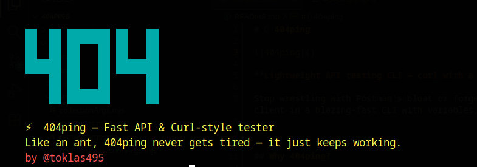

# 🚀 404ping



**Lightweight API testing CLI — curl with a brain**

Stop wrestling with Postman's bloat or forgetting your curl flags. 404ping gives you the power of a full API client in a blazing-fast CLI with variables, collections, and saved requests.

### ✨ Key Features

- 🚀 **Lightning Fast**: Instant startup, no heavy dependencies
- 🔐 **Secure by Default**: SSL certificate verification enabled, explicit insecure mode
- 📊 **Rich Output**: Multiple output modes for developers, bug hunters, and security auditors
- 🔄 **Variable System**: Global and collection-scoped variables with automatic resolution
- 📁 **Collections**: Organize requests by project or feature
- 💾 **Smart Saving**: Stores raw requests with variables for automatic updates
- 🐛 **Developer-Friendly**: Comprehensive error messages, connection debugging, TLS inspection
- 🎯 **Production Ready**: Input validation, path traversal protection, secure file operations

---

## Why 404ping?

| Feature | curl | Postman | 404ping |
|---------|------|---------|---------|
| Lightweight | ✅ | ❌ | ✅ |
| Variables | ❌ | ✅ | ✅ |
| Collections | ❌ | ✅ | ✅ |
| Save & Reuse Requests | ❌ | ✅ | ✅ |
| No GUI Required | ✅ | ❌ | ✅ |
| Fast Startup | ✅ | ❌ | ✅ |
| Comprehensive Error Messages | ⚠️ | ✅ | ✅ |
| Detailed Response Analysis | ❌ | ✅ | ✅ |
| SSL/TLS Certificate Inspection | ⚠️ | ✅ | ✅ |
| Connection Debugging | ❌ | ✅ | ✅ |
| Security by Default | ✅ | ✅ | ✅ |

---

## 📦 Installation

```bash
# Clone the repository
git clone https://github.com/toklas495/404ping.git
cd 404ping

# Install dependencies
npm install

# Build and link globally
npm run build
```

Now you can use `404ping` from anywhere in your terminal!

---

## 🎯 Quick Start

```bash
# Simple GET request
404ping request https://api.example.com/users

# POST with JSON body
404ping request https://api.example.com/login -X POST -d '{"email":"test@example.com","password":"secret"}'

# With custom headers
404ping request https://api.example.com/me -H "Authorization: Bearer mytoken"

# Quick save to collection (NEW!)
404ping request {{host}}/api/login -X POST -d '{"email":"{{email}}"}' --save myapp.login
```

---

## 💡 Core Concepts

### 🔹 Variables

Set variables once, use them everywhere with `{{variable}}` syntax. Variables can be global or collection-scoped.

**Global Variables:**
```bash
# Set global variables (no collection prefix)
404ping set host:https://api.myapp.com token:abc123

# Use in requests
404ping request {{host}}/users/me -H "Authorization: Bearer {{token}}"
```

**Collection Variables:**
```bash
# Set collection-scoped variables (format: collection.variable:value)
404ping set myapp.host:https://api.myapp.com myapp.token:abc123

# Use in requests
404ping request {{myapp.host}}/users/me -H "Authorization: Bearer {{myapp.token}}"
```

**Variable Management:**
```bash
# List all variables (global and collection-scoped)
404ping vars

# Remove global variables
404ping unset host token

# Remove collection variables
404ping unset myapp.host myapp.token
```

### 🔹 Collections

Group related requests together — perfect for organizing APIs by project or feature.

**Two ways to save requests:**

```bash
# Method 1: Quick save with --save flag (NEW!)
404ping request {{host}}/api/login -X POST -d '{"email":"{{email}}"}' --save myapp.login

# Method 2: Traditional collection save
404ping collection save myapp login -X POST {{host}}/auth/login -d '{"email":"{{email}}","password":"{{pass}}"}'

# Create a collection first
404ping collection create myapp

# Save another request
404ping collection save myapp get-profile {{host}}/users/me -H "Authorization: Bearer {{token}}"

# List all collections
404ping collection list

# Show requests in a collection
404ping collection show myapp
```

**Note:** Both methods store raw requests with variables (like `{{host}}`), so when you change variable values, all saved requests automatically use the new values!

### 🔹 Run Saved Requests

Execute saved requests instantly with `run` command.

```bash
# Run a saved request
404ping run myapp:login

# Override URL temporarily (doesn't save)
404ping run myapp:login -u "https://staging.myapp.com/auth/login"

# Override and SAVE the changes
404ping run myapp:login -u "https://newapi.myapp.com/auth/login" --save

# Override method, headers, or body
404ping run myapp:get-profile -H "Authorization: Bearer newtoken"
```


---

## 📖 Command Reference

### `request <url>`

Send HTTP requests with comprehensive output options.

| Option | Alias | Description |
|--------|-------|-------------|
| `--method` | `-X` | HTTP method (GET, POST, PUT, DELETE, PATCH, HEAD, OPTIONS) |
| `--data` | `-d` | JSON request body |
| `--header` | `-H` | Custom headers (repeatable) |
| `--s_header` | `-i` | Show response headers + body |
| `--size` | | Show response size in bytes (human-readable) |
| `--raw` | | Output raw response body (no formatting) |
| `--info` | | **Comprehensive summary** - Request/Response details, timing, connection info, TLS details |
| `--connection` | | Show detailed connection information (IPs, ports, keep-alive, bytes transferred) |
| `--tls` | | Show TLS/SSL certificate details (for HTTPS) |
| `--debug` | | Full structured dump with all request/response data |
| `--redirect` | `-L` | Follow HTTP redirects (301, 302, 303, 307, 308) |
| `--timeout` | | Request timeout in milliseconds |
| `--insecure` | `-k` | Allow insecure SSL connections (bypass certificate verification) |
| `--save` | | Save request to collection (format: `collection.request`) |

**Output Modes:**

```bash
# Default: Clean JSON/body output
404ping request https://api.example.com/users

# Show headers + body
404ping request https://api.example.com/users -i

# Comprehensive summary (perfect for developers/bug hunters)
404ping request https://api.example.com/users --info

# Connection details
404ping request https://api.example.com/users --connection

# TLS/SSL certificate information
404ping request https://api.example.com/users --tls

# Full debug dump
404ping request https://api.example.com/users --debug

# Save to collection while testing
404ping request {{host}}/api/login -X POST -d '{"email":"{{email}}"}' --save myapp.login
```

**Example with all features:**

```bash
404ping request https://api.example.com/posts -X POST \
  -d '{"title":"Hello","body":"World"}' \
  -H "Content-Type: application/json" \
  -H "Authorization: Bearer {{token}}" \
  --info \
  --save myapp.create-post
```

### `set <variables..>`

Set one or more variables. Variables are automatically global or collection-scoped based on the format.

**Format:**
- **Global variables**: `variable:value` (e.g., `host:https://api.com`)
- **Collection variables**: `collection.variable:value` (e.g., `myapp.host:https://api.com`)

```bash
# Set global variables
404ping set host:https://api.prod.com env:production token:abc123

# Set collection-scoped variables
404ping set myapp.host:https://api.myapp.com myapp.token:xyz789

# Mix global and collection variables
404ping set host:https://api.com myapp.token:abc123
```

**Usage in requests:**
- Global: `{{host}}` → uses global `host` variable
- Collection: `{{myapp.host}}` → uses `host` variable from `myapp` collection

### `unset <variables..>`

Remove variables.

```bash
404ping unset host token env
```

### `vars`

List all saved variables.

```bash
404ping vars
```

### `collection <action> [name] [request]`

Manage collections.

| Action | Description |
|--------|-------------|
| `create` | Create a new collection |
| `save` | Save a request to collection |
| `list` | List all collections |
| `show` | Show requests in a collection |

```bash
# Create
404ping collection create github-api

# Save request
404ping collection save github-api repos {{github_host}}/user/repos \
  -H "Authorization: token {{github_token}}"

# List collections
404ping collection list

# Show collection details
404ping collection show github-api
```

### `run <collection:request>`

Run a saved request from a collection. All output modes from `request` command are available.

| Option | Alias | Description |
|--------|-------|-------------|
| `--url` | `-u` | Override URL temporarily |
| `--method` | `-X` | Override HTTP method |
| `--data` | `-d` | Override request body |
| `--header` | `-H` | Override/add headers |
| `--save` | | Save overrides permanently to collection |
| `--s_header` | `-i` | Show response headers + body |
| `--size` | | Show response size |
| `--raw` | | Output raw response |
| `--info` | | Comprehensive summary |
| `--connection` | | Connection details |
| `--tls` | | TLS/SSL details |
| `--debug` | | Full structured dump |

```bash
# Basic run
404ping run myapp:login

# Override without saving
404ping run myapp:login -u "https://staging.api.com/login"

# Override AND save permanently
404ping run myapp:login -d '{"email":"new@email.com"}' --save

# Run with detailed info
404ping run myapp:profile --info

# Run with connection details
404ping run myapp:api-call --connection
```

---

## 🔥 Real-World Workflow

```bash
# 1. Setup your environment (global variables)
404ping set host:https://api.myapp.com token:abc123

# Or use collection-scoped variables
404ping set myapp.host:https://api.myapp.com myapp.token:abc123

# 2. Create a collection for your project
404ping collection create myapp

# 3. Save your login request (quick method with --save)
404ping request {{host}}/auth/login -X POST \
  -d '{"email":"dev@myapp.com","password":"secret123"}' \
  --save myapp.login

# Or use collection variables
404ping request {{myapp.host}}/auth/login -X POST \
  -d '{"email":"dev@myapp.com","password":"secret123"}' \
  --save myapp.login

# Or use traditional method
404ping collection save myapp login -X POST {{host}}/auth/login \
  -d '{"email":"dev@myapp.com","password":"secret123"}'

# 4. Run it anytime
404ping run myapp:login

# 5. Got a token? Update it!
404ping set token:eyJhbGciOiJIUzI1NiIs...

# Or update collection variable
404ping set myapp.token:eyJhbGciOiJIUzI1NiIs...

# 6. Save authenticated requests (quick method)
404ping request {{host}}/users/me \
  -H "Authorization: Bearer {{token}}" \
  --save myapp.profile

# 7. Test your API with detailed info
404ping run myapp:profile --info

# 8. Debug connection issues
404ping run myapp:api-call --connection

# 9. Check SSL certificate
404ping request https://api.myapp.com/secure --tls
```

---

## 🎨 Output Modes Explained

404ping provides multiple output modes for different use cases:

### Default Mode
Clean, formatted JSON or text output - perfect for quick checks.

### `--info` Mode (Recommended for Developers)
Comprehensive summary showing:
- **Request Details**: Method, URL, host, headers count, body size
- **Response Details**: Status code, protocol, duration, timestamp
- **Size Information**: Body, headers, and total bytes (human-readable)
- **Connection Info**: Local/remote IPs, ports, keep-alive status, bytes transferred
- **TLS/SSL Info**: Certificate details, validity, security warnings
- **Status Indicators**: Color-coded status codes with visual indicators

### `--connection` Mode
Detailed network connection information:
- Connection reuse (keep-alive)
- Local and remote IP addresses and ports
- Bytes read/written
- Connection performance metrics

### `--tls` Mode
SSL/TLS certificate inspection:
- Certificate validity and expiration
- Subject and issuer information
- Protocol and cipher details
- Security warnings for invalid certificates

### `--debug` Mode
Complete structured dump with all request/response data in organized sections.

## 🔒 Security Features

- **Secure by Default**: SSL certificate verification enabled by default
- **Explicit Insecure Mode**: Use `--insecure` (`-k`) flag to bypass certificate verification (not recommended)
- **Input Validation**: All inputs are validated and sanitized
- **Path Traversal Protection**: File operations are secured against path traversal attacks
- **Header Validation**: Invalid headers are rejected

## ⚠️ Error Handling

404ping provides comprehensive, curl/postman-like error messages:

- **Network Errors**: DNS resolution, connection refused, timeouts
- **HTTP Errors**: Detailed status code information with context
- **SSL/TLS Errors**: Certificate validation errors with suggestions
- **Validation Errors**: Clear messages for invalid inputs
- **File Errors**: Permission and file not found errors

All errors include:
- Error codes and categories
- Detailed context (URLs, status codes, file paths)
- Helpful suggestions for common issues

## 🛠️ Development

```bash
# Run in development mode
npm run dev

# Build for global usage
npm run build
```

---

## 📄 License

MIT © [toklas495](https://github.com/toklas495)

---

<p align="center">
  <b>404ping</b> — Because life's too short for heavy API clients 🏃‍♂️💨
</p>
